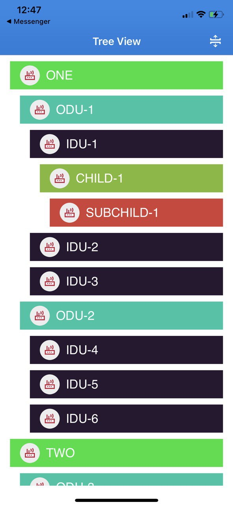

# TreeView-iOS
A simple treeview designed in Swift



 This actual data format included in project folder name 'File.json'.
 
 Actually there is no expandable property in Tableview.So how can we acheive this expandable property?
 
 The concept is we can insert new cell immidiate after the cell that i want to expand.
 
 -Suppose my example data set be like below--
 ```
 "objects": [
     {
         "id": "parent",
         "name": "parent",
         "level": 1,
         "objects": [
             {
                 "id": "child-1",
                 "name": "child-1",
                 "level": 2,
             },
             {
                 "id": "child-2",
                 "name": "child-2",
                 "level": 2,
             }
         ]
     }
 ]
 ```
 Here in the data, suppose the first cell is with name 'parent' and level is '1'.
 Each cell has unique 'id'.
 When any one clicked on the first cell named 'parent', we will then search for 'objects'(child) with level = 2
 If we found any objects then we will copy the array with 'objects' and insert this object to the next position of parent array and the data will be like below
 ```
 "objects": [
     {
         "id": "parent",
         "name": "parent",
         "level": 1,
         "objects": [
             {
                 "id": "child-1",
                 "name": "child-1",
                 "level": 2,
             },
             {
                 "id": "child-2",
                 "name": "child-2",
                 "level": 2,
             }
         ]
     },
    {
        "id": "child-1",
        "name": "child-1",
        "level": 2,
    },
    {
        "id": "child-2",
        "name": "child-2",
        "level": 2,
    }
 ]
 ```
  What I did here is just add the inner objects after the expandable cell and if click for unexpand then just delete the added item. 
  And this is done by 'indexOfObjectIdentical'.
